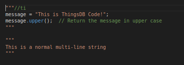

# Python string SQL

Need for this project arise of daily work with [PySpark](https://spark.apache.org/docs/2.2.0/api/python/pyspark.html) scripts that have a lot of sql inside.
This project's aim is to enable syntax highlighting for SQL inside Python multiline strings, especially PySpark, using VS Code.

## Installation

As the extension is in development, installation is only possible manually.

Install [node.js](https://nodejs.org/) and then then install the [vsce](https://www.npmjs.com/package/vsce) package:

```
npm install --global vsce
```

Clone the repository and open a terminal at the project root and execute the following command:

```
vsce package
```

The resulting `.vsix` file can be installed via the VSCode GUI.

## Usage

### Currently:
SQL hilighting starts after keywords `SELECT`, `INSERT` and `CREATE TABLE` at the start of multi-line string.

## Acknowledgements

This project was cloned from Mark Wibrow project [python-string-sql](https://github.com/mwibrow/python-string-sql), that was was adpated from [es6-string-html](https://github.com/hanjingboo/es6-string-html).
Considerable insight into writing the [TextMate grammars](https://macromates.com/manual/en/language_grammars) used by VS Code, can be found in an [old blog post](https://www.apeth.com/nonblog/stories/textmatebundle.html) by Matt Neuburg. 

## Contribution

Currently, only contributors to the Mark's Wibrow's project and me have contributed. If anybody would like to contribute, just create a pull request and/or issue. Thank you!
